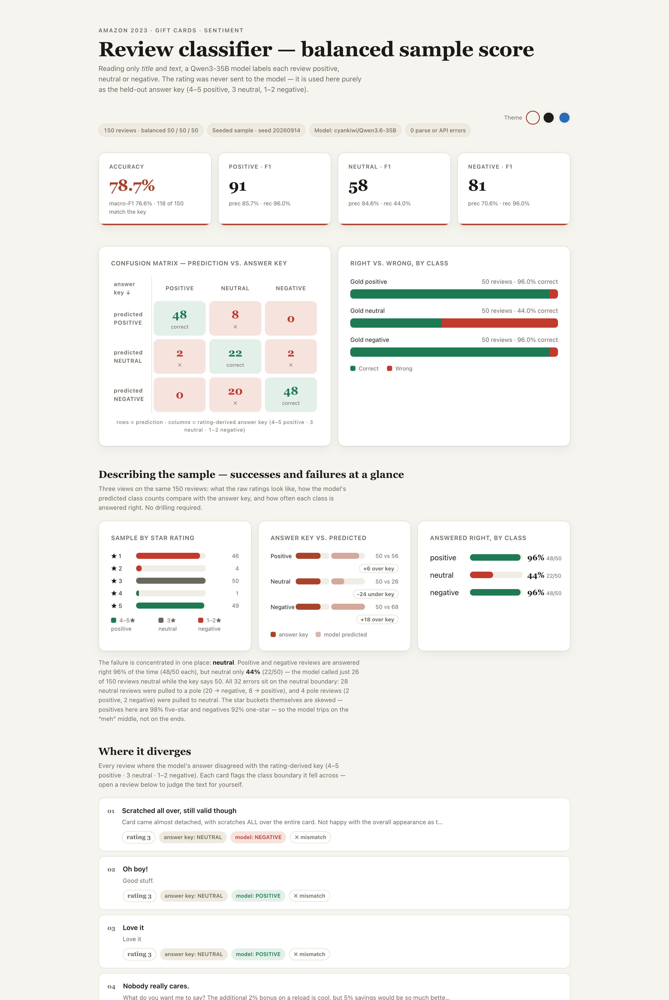
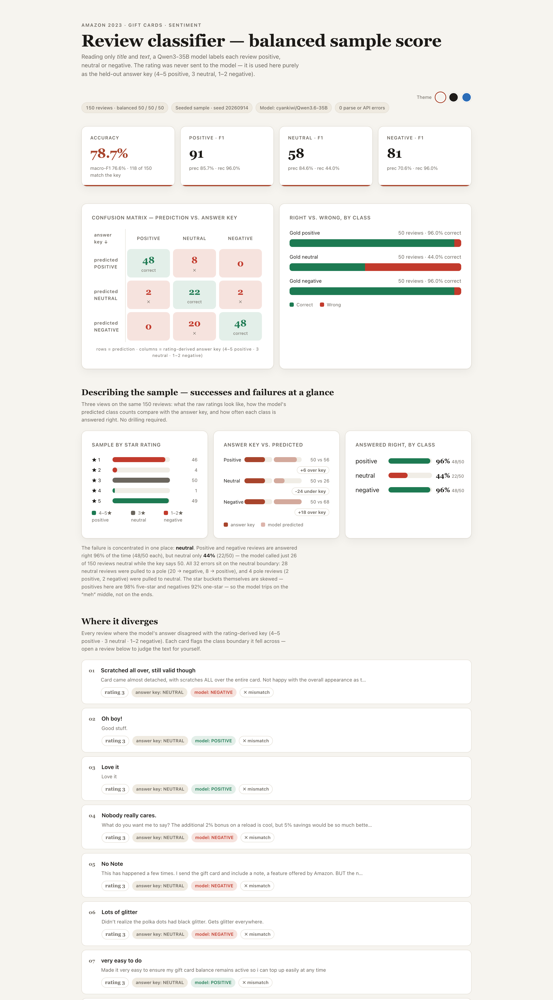
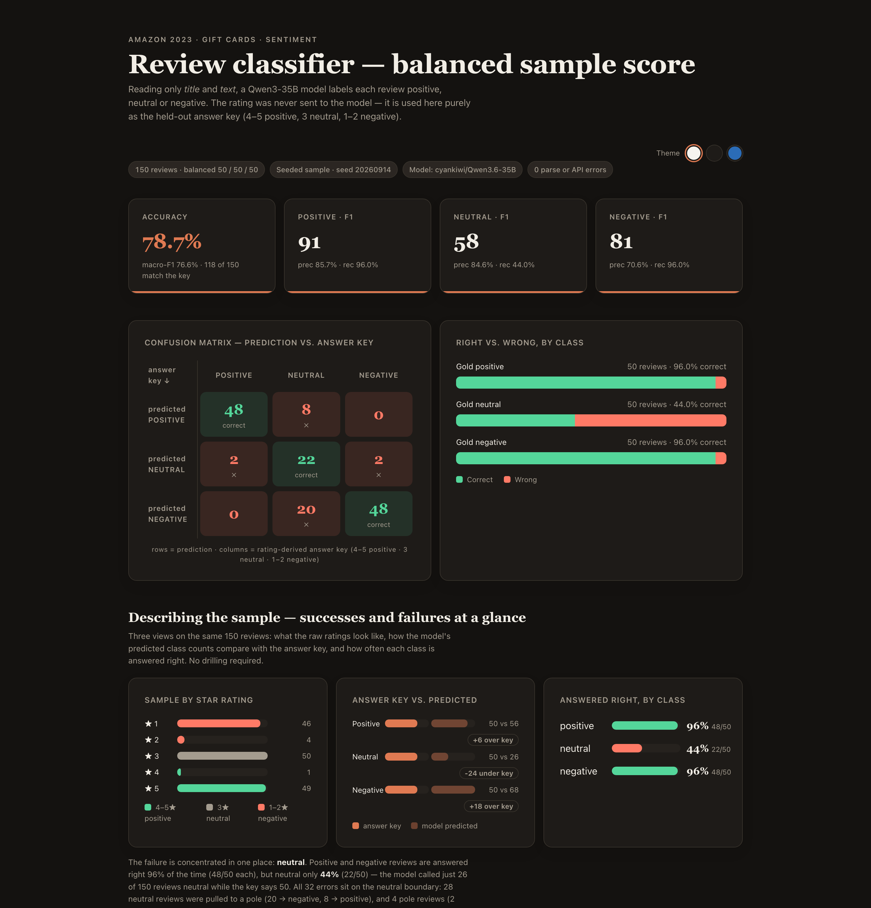

# Gift Card Review Sentiment — LLM + Lexicon Classification Report

A three way sentiment classifier (positive / neutral / negative) for Amazon gift-card
reviews, built from **title + text only**. A 35B Qwen3 LLM serves as the classifier; an
NRC word-emotion lexicon provides a second, model-free read on each review's primary
emotion; and a self-contained HTML dashboard makes every number verifiable at a glance.

**Data:** [Amazon Reviews '23](https://amazon-reviews-2023.github.io/) — a dataset of
571.5M Amazon reviews collected by the **McAuley Lab, UCSD** (paper listed at the
dataset page, arXiv:2403.03952). This project uses the **Gift_Cards** category,
[`review_categories/Gift_Cards.jsonl.gz`](https://mcauleylab.ucsd.edu/public_datasets/data/amazon_2023/raw/review_categories/Gift_Cards.jsonl.gz)
(152,410 reviews), copied verbatim into `data/raw/`.

**Classifier endpoint:** OpenAI-compatible vLLM server serving
`cyankiwi/Qwen3.6-35B-A3B-AWQ-4bit`. Thinking-mode is disabled
(`chat_template_kwargs: {"enable_thinking": false}`), `temperature: 0`.

**The one rule that matters:** the model only ever sees `title` + `text`. The star
rating is used **exclusively after the fact** to build the answer key:

| Rating | Class |
|---|---|
| 4–5 ★ | POSITIVE |
| 3 ★ | NEUTRAL |
| 1–2 ★ | NEGATIVE |

---

## Contents

1. [Results at a glance](#results-at-a-glance)
2. [Q1 — Why the lopsided run looked very accurate, and what did balanced sampling change?](#q1)
3. [Q2 — Where do the model's mistakes go?](#q2)
4. [Q3 — How do the LLM's emotions and the word list's emotions differ, and why?](#q3)
5. [Q4 — Bugs and issues hit along the way](#q4)
6. [Files and how to reproduce](#files-and-how-to-reproduce)
7. [References](#references)

---

## Results at a glance

Balanced sample: **150 reviews (50 per class)**, drawn with a fixed seed
(`20260914`) from the whole 152,410-review file so the same set comes out every run.

| Metric | Value |
|---|---|
| Accuracy | **78.7%** (118 of 150 match the key) |
| Macro-F1 | **76.6%** |
| POSITIVE — prec / rec / F1 | 85.7% / 96.0% / **90.6** |
| NEUTRAL — prec / rec / F1 | 84.6% / 44.0% / **57.9** |
| NEGATIVE — prec / rec / F1 | 70.6% / 96.0% / **81.4** |
| Errors (of 150) | 32 |

> Every number above appears in `results/metrics.json` and on the dashboard
> (`dashboard/sentiment_dashboard.html`).

**The dashboard** (single self-contained HTML file, all data baked in, works offline —
open it in any browser):



*Header, KPI cards, the 3×3 confusion matrix, right-vs-wrong bars, and the descriptive
layer (star distribution, answer-key-vs-predicted, answered-right meters).*



*The descriptive layer, the "Where it diverges" mismatch cards, and the emotion
two-takes section (table hidden in this capture).*



*The same dashboard recolored via the token-based theme system (CSS custom properties).*

---

## Q1 — Why the lopsided run looked very accurate, and what did balanced sampling change?<a name="q1"></a>

The first experiment was lopsided in two ways:

1. **It read the file head-first.** The first 100 rows of `Gift_Cards.jsonl`
   contain **93 positive and 7 negative reviews — and zero 3-star reviews**. The
   neutral class (the hardest to score) was absent from the test set entirely
   (`results/first100_predictions.csv`).
2. **It used a binary schema** ("4–5 ★ positive, else negative"), so the
   3-star reviews that *do* exist in the corpus were silently merged into the
   "negative" bucket instead of being their own class.

On that test set the model scored **98.0% accuracy (98 of 100)** with per-class F1
of **98.9** (positive) / **85.7** (negative). That looks excellent — but it is an
artifact of the test set, not of the model. A trivial classifier that labels
*everything* positive would have scored 93.0% on the same data: the accuracy was
inflated by a ~93/7 base rate, and the error-free-looking scores hid the fact that
the ambiguous middle class was never tested.

The full corpus makes the imbalance explicit (from `Gift_Cards.jsonl`,
`results/metrics.json`):

| Rating | Reviews |
|---|---|
| 5 ★ | 128,248 |
| 4 ★ | 6,692 |
| 3 ★ | 3,271 |
| 2 ★ | 1,873 |
| 1 ★ | 12,326 |

i.e. ~88.5% of reviews are 4–5 ★, only 2.1% are 3 ★, and the file is not sorted
randomly — the tail of the file is where the rare classes live. Even inside the
balanced sample the stars are end-loaded: the 50 gold-positive reviews are 98%
five-star and the 50 gold-negative ones 92% one-star, so 4★ and 2★ reviews are
scarcely sampled at all (1 and 4 of 150 respectively).

**What changed:** the evaluation now draws **50 reviews per class** from the whole
file (`scripts/sample_balanced.py`, seed `20260914`), and the schema is the proper
3-class one. Same model, same prompt family — but now every class is tested on 50
reviews. The honest result: **78.7% accuracy, 76.6% macro-F1**, with the model
clearly struggling on NEUTRAL (recall 44.0%). The previous 98% was the easy
problem; 78.7% is the real one. On the balanced set a majority-class baseline would
score 33.3%, so 78.7% is still far above chance.

---

## Q2 — Where do the model's mistakes go?<a name="q2"></a>

Confusion matrix, prediction vs. answer key (150 reviews; exact numbers in
`results/metrics.json`):

| predicted ↓ / key → | POSITIVE | NEUTRAL | NEGATIVE |
|---|---|---|---|
| **POSITIVE** | 48 | 8 | 0 |
| **NEUTRAL** | 2 | 22 | 2 |
| **NEGATIVE** | 0 | 20 | 48 |

**The mistakes are almost entirely one-directional, and they all touch the neutral
class.** Of the 32 errors:

- **NEUTRAL → NEGATIVE: 20** (the single biggest cell). Three-star reviews — "It
  did its job", "minor complaint" — get read as complaints.
- **NEUTRAL → POSITIVE: 8**. Short, literally-praising 3-star reviews ("Good
  stuff.") get read as positive.
- **POSITIVE → NEUTRAL: 2** and **NEGATIVE → NEUTRAL: 2** — a handful of pole
  reviews that are textually lukewarm get pulled to the middle.

So: ★★★ (neutral-gold) reviews are labeled negative **more than twice as often**
as they are labeled positive (20 vs 8), and the model **under-predicts neutral
massively** — it called just 26 of 150 reviews neutral while the key says 50
(`predicted_per_class` vs `gold_per_class` in `metrics.json`). The answer key /
predicted comparison on the dashboard puts the same story in bars:
POSITIVE 50 vs 56 (+6 over key), NEUTRAL 50 vs 26 (-24 under key),
NEGATIVE 50 vs 68 (+18 over key).

In plain terms: the model nails the poles (96.0% recall on both positive and
negative) and trips on the "meh" middle — it treats "okay / it worked / minor
gripe" reviews as either complaints or praise instead of neutrality.

---

## Q3 — How do the LLM's emotions and the word list's emotions differ, and why?<a name="q3"></a>

Each review also gets a **primary emotion** from the NRC set (anger, anticipation,
disgust, fear, joy, sadness, surprise, trust) two independent ways:

- **LLM take** — the same prompt now returns `{"sentiment", "emotion"}`;
  the model reads the whole review and picks one emotion.
- **Word-list take** — `scripts/emote_wordlist.py` scores every word against the
  **NRC word-level emotion lexicon** (Mohammad & Turney, 2013; bundled in
  `lexicon/`), sums association counts per emotion, and takes the highest.
  Zero model calls.

Primary-emotion distributions over the same 150 reviews (`results/metrics.json`:

| Emotion | LLM | Word list |
|---|---|---|
| anger | 30 | 11 |
| anticipation | **0** | **64** |
| disgust | 13 | 3 |
| fear | 4 | 4 |
| joy | 25 | 15 |
| sadness | 10 | 2 |
| surprise | 14 | 3 |
| trust | 25 | 15 |
| neutral | 29 | 33 |

**Agreement: 28 of 150 (19%).**

The divergence is systematic, and the reason is the method:

1. **The word list cannot read context.** NRC tags everyday gift-card vocabulary —
   *gift, card, perfect, arrives, buy, order* — as **anticipation** and *trust*.
   A card-text review ("it's a gift card, what can you say") soaks up
   anticipation tags, so the lexicon picks anticipation **64 of 150 times** while
   the LLM picks it **0 times**. The same blindness to negation means "this card
   is a scam" still scores *trust* (from "trust").
2. **The LLM reads meaning.** On the same texts it lands on *anger* (30), *joy*
   (25), *trust* (25) or *neutral* (29) — matching what the review actually
   expresses. The balanced sample is deliberately negative-heavy (50 negative
   reviews), which is why anger is the LLM's top emotion (30 vs the lexicon's 11).
3. The lexicon also produces degenerate cases the LLM doesn't: **33 of 150
   reviews contain no emotional words at all** (lexicon "neutral"), and **64 of
   150 have a tie** for top score, resolved to the first emotion in NRC order —
   both are visible in `results/emote_wordlist.json`.

So the word list is a good *lexical signal* — its counts correlate with how much
emotional vocabulary a review uses — but it is not a good *primary-emotion*
estimate for this domain. Treat its answer as "most frequent NRC-tagged word",
not the review's feeling.

---

## Q4 — Bugs and issues hit along the way<a name="q4"></a>

**Model / API side**

1. **The model's answers came back empty.** The endpoint serves a Qwen3
   *thinking* model; with thinking enabled the JSON landed in the `reasoning`
   field and `content` was `null`. Fix: `"chat_template_kwargs": {
   "enable_thinking": false }` (kept in the prompt file and every script).
2. **Truncated JSON on long reviews.** With `max_tokens: 60`, 2 of the reviews
   (one in the first batch, one in the balanced run) returned cut-off JSON with
   the `emotion` field missing. Fix: detect missing fields and re-pull those rows
   with `max_tokens: 120`.
3. **An out-of-schema emotion.** One run returned `"emotion": "disappointment"`,
   which is not in the NRC eight. Fix: normalize to the nearest NRC family
   (disappointment → sadness) and document it; the merge step (`build_dashboard.py`)
   applies the mapping.

**Reporting side**

4. **My own accuracy bug.** The first scoring pass printed accuracy as `100%`
   because the script divided correct-by-*matches* (98/98) instead of by the
   total (98/100). Caught when the confusion-matrix numbers didn't add up;
   corrected to 98.0%. Lesson: cross-check the headline number against the raw
   contingency table — it was a reminder that an LLM pipeline can *look* flawless
   while a counting bug is what's perfect.
5. **Head-of-file sampling distorted the test.** The first 100 rows contained
   zero 3-star reviews, which is *why* the binary run looked so good (see Q1).
   Fix: seeded, per-class balanced sampling from the whole file.
6. **The word-list script printed `hits on 117/100`** — a hardcoded denominator
   left in a log line. Cosmetic, but it violated the "every number on the page
   must be real" rule, so it's fixed in the committed script and the label now
   reads `117/150`.

**Chart / UI side**

7. **A stale syntax-error placeholder.** An early dashboard draft shipped a junk
   line (`const MACRO = (()=>{})()`) that broke the whole script — caught by
   `node --check` on the injected JS before anything rendered. The page *looked*
   fine in preview because the HTML was valid; only the JS was dead.
8. **The expandable review rows didn't expand.** The CSS selector
   `tr.open .detail` targeted a *child* of the row, but the detail row is a
   *sibling* — so the toggle silently did nothing. Fix: drive visibility with
   explicit `.show`/`.open` classes on the detail row.
9. **Tiny bars collapse.** With 150 reviews, some buckets are tiny (★4 has
   exactly 1 review — 0.7% of the sample). A percentage width of ~0.7% renders
   as an invisible sliver or collapses to zero. Fix: every bar fill gets
   `min-width: 4px` in CSS **and** `Math.max(4, pct)` in the JS width, so the
   smallest buckets stay visible. Verified in the screenshots: ★2 and ★4 render
   as small-but-present bars.
10. **Live-verification tooling friction.** The in-app preview harness had
    stale element refs and a flaky accessibility tree (theme swatches vanished
    from its inventory though they existed in the DOM). Workaround: click by CSS
    selector instead of ref, verify computed quantities on the rendered page
    text, and validate every figure against the saved data — 44/44 checks
    passed on the final dashboard.

---

## Files and how to reproduce<a name="files-and-how-to-reproduce"></a>

| Deliverable | File |
|---|---|
| Final report | `README.md` (this file) |
| Prompt (sentiment + emotion, few-shot) | `prompts/prompt_sentiment_emotion.md` |
| Scoring script (runs the reviews through the LLM) | `scripts/emote_llm.py` |
| Legacy binary scorer (first-batch experiment) | `scripts/classify.py` |
| Word-list emotion script (no model calls) | `scripts/emote_wordlist.py` |
| Balanced sampler (seed 20260914, 50/class) | `scripts/sample_balanced.py` |
| Dashboard generator | `scripts/build_dashboard.py` |
| Dashboard template | `dashboard/dashboard_template.html` |
| **Final dashboard** (self-contained, offline) | `dashboard/sentiment_dashboard.html` |
| Balanced run — raw LLM output (sentiment + emotion per review) | `results/sample150_emote_llm.csv` |
| Balanced run — merged evaluation (gold + predictions + both emotions) | `results/evaluation_balanced.json` |
| All headline numbers (machine-readable) | `results/metrics.json` |
| Word-list emotion output | `results/emote_wordlist.json` |
| First-batch raw predictions (lopsided run) | `results/first100_predictions.csv` |
| NRC word-level emotion lexicon (public) | `lexicon/NRC-Emotion-Lexicon-Wordlevel-v0.92.txt` |
| Raw data (kept compressed) | `data/raw/Gift_Cards.jsonl.gz` |

Reproduce end-to-end (Python 3 stdlib only; no pip installs):

```bash
# 1. (optional) re-download the raw data into data/raw/
curl -O https://mcauleylab.ucsd.edu/public_datasets/data/amazon_2023/raw/review_categories/Gift_Cards.jsonl.gz

# 2. draw the balanced sample (fixed seed -> identical set every time)
python3 scripts/sample_balanced.py

# 3. run the LLM classifier (set LLM_API_URL / LLM_API_KEY to override)
python3 scripts/emote_llm.py

# 4. score emotions from the NRC word list (no model calls)
python3 scripts/emote_wordlist.py

# 5. merge everything and (re)build the self-contained dashboard
python3 scripts/build_dashboard.py

# 6. open the dashboard — works offline, nothing to serve
open dashboard/sentiment_dashboard.html
```

Notes:

- The classifier endpoint and key are assignment-provided; override with
  `LLM_API_URL` / `LLM_API_KEY` environment variables if you use your own.
- The dashboard is a single file with all 150 reviews and their predictions
  baked in — it makes zero network requests.

## References<a name="references"></a>

- Amazon Reviews '23 dataset — McAuley Lab, UCSD.
  Official page: <https://amazon-reviews-2023.github.io/> ·
  arXiv:2403.03952 (as listed on the dataset page).
  Raw file used: <https://mcauleylab.ucsd.edu/public_datasets/data/amazon_2023/raw/review_categories/Gift_Cards.jsonl.gz>
- Mohammad, S. M., & Turney, P. D. (2013). *Crowdsourcing a Word-Emotion
  Association Lexicon.* Computational Intelligence, 29(3), 436–465.
  Lexicon page: <https://saifmohammad.com/WebPages/NRC-Emotion-Lexicon.htm>
- Classifier backend: `cyankiwi/Qwen3.6-35B-A3B-AWQ-4bit` served via vLLM
  (OpenAI-compatible API).
